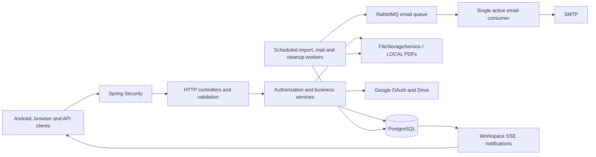

# Booker SaaS API

Booker is a multi-tenant book catalogue and PDF reading backend. Each signup
creates an empty workspace and owner account. Private libraries are workspace
scoped; a global library is available to authenticated accounts and managed by
Super Admin.

This repository contains the Spring Boot API. Android and Angular client
requirements are documented here, but client application sources are maintained
separately.

## Contents

- [Capabilities](#capabilities)
- [Architecture and stack](#architecture-and-stack)
- [Local development](#local-development)
- [Environment configuration](#environment-configuration)
- [API and first requests](#api-and-first-requests)
- [Documents and reading progress](#documents-and-reading-progress)
- [External integrations and administration](#external-integrations-and-administration)
- [Database and upgrades](#database-and-upgrades)
- [Security](#security)
- [Testing and CI](#testing-and-ci)
- [Deployment and operations](#deployment-and-operations)
- [Troubleshooting](#troubleshooting)
- [Documentation and contributing](#documentation-and-contributing)

## Capabilities

- Workspace signup, JWT login/rotating refresh/logout, legacy Basic authentication,
  password changes and emailed password recovery.
- Private book creation, numeric-ID lookup and exact author/title filtering, with
  configurable workspace quotas and operator-managed FREE/PRO entitlements.
- PDF upload, immutable replacement, authenticated streaming/Range/HEAD and saved
  reading position. Private progress is per account; public progress is per workspace.
- Browser-bound Google Drive OAuth/Picker and queued PDF import into local storage.
- Super Admin public catalogue management and workspace book requests with review,
  durable SSE notifications and RabbitMQ-queued administrator/requester emails,
  delivered sequentially with bounded retries.

Billing, team invitations, email verification, private metadata editing/deletion,
server pagination, object storage and mobile push are not implemented. Proposed
work is tracked in [PROMPTS.md](PROMPTS.md).

## Architecture and stack

Java 25, Spring Boot 4.1.1, Spring MVC/Security, PostgreSQL, RabbitMQ, Flyway, JPA/JDBC,
PDFBox 3.0.8 and springdoc 3.1.0. Compose uses PostgreSQL 18. Services own business
rules and transactions; controllers handle HTTP. JPA manages book metadata; JDBC
handles accounts, document metadata, progress, queues and events. PDFs are stored
outside PostgreSQL through `FileStorageService`; LOCAL is the current provider.



| Component | Implementation |
| --- | --- |
| Runtime and build | Java 25; Maven wrapper; Spring Boot 4.1.1 |
| HTTP and security | Spring MVC, Jakarta Validation, Spring Security, JWT and legacy Basic |
| Messaging | RabbitMQ 4.2; durable quorum email queue, single active consumer and prefetch 1 |
| Persistence | PostgreSQL; Spring Data JPA for books; JDBC for other feature state |
| Schema evolution | Flyway; Hibernate schema validation; open-in-view disabled |
| PDF processing | Apache PDFBox 3.0.8; file storage outside the database |
| API documentation | springdoc 3.1.0; Swagger UI and generated OpenAPI |
| Operations | Actuator health; OpenTelemetry dependencies; local Grafana/OTel Compose service |
| Verification | JUnit/Spring tests, GitHub Actions and configured Qodana analysis |

No application cache is implemented. RabbitMQ carries opaque IDs for request/decision
email receipts, while PostgreSQL retains email bodies, retry state and durable work.
Import jobs, notification events, progress retries and file cleanup remain in PostgreSQL. JobRunr is a dependency; application jobs
and an exposed JobRunr dashboard are not established by that dependency.

```text
src/main/java/com/parvez/android/   Controllers, services and feature packages
src/main/resources/                Environment-backed properties and Flyway V1–V14
src/test/java/                     Unit, MVC, database and real HTTP tests
.mvn/wrapper/                      Maven wrapper distribution configuration
.github/workflows/                 Build, test and Docker validation
docs/                             Feature design and operations guides
compose.yaml                      Local database, RabbitMQ, backend and Grafana/OTel services
Dockerfile                        Multi-stage Java build; non-root runtime
.env.example                      Safe environment configuration template
API.md                            Endpoint contracts, DTOs and request examples
PROMPTS.md                        Proposed engineering work and acceptance criteria
qodana.yaml                       JVM static-analysis configuration
```

See [architecture and invariants](docs/code-quality-review.md) and the
[contributor guide](AGENTS.md).

## Local development

Choose Docker for the complete local stack, or run the backend from source.

| Mode | Prerequisites |
| --- | --- |
| Docker | Docker Engine/Desktop with Compose v2; available ports 8080, 5432, 5672, 15672, 3000, 4317 and 4318 |
| Source | JDK 25, PostgreSQL (18 matches Compose/CI), RabbitMQ (4.2 matches Compose/CI), shell access and the Maven wrapper |
| Verification | Disposable PostgreSQL and RabbitMQ, JDK 25 and Docker for container validation |

The wrapper downloads Maven; initial builds need dependency download access.
OpenSSL is used in the examples to generate signing and encryption keys.

### Docker

```sh
cp .env.example .env
# Set strong DATABASE_PASSWORD and RABBITMQ_PASSWORD values.
# Set JWT_SECRET using openssl rand -base64 32.
docker compose config --quiet
docker compose up --build -d
curl http://localhost:8080/actuator/health
```

Useful local commands:

```sh
docker compose ps
docker compose logs -f app
docker compose stop
docker compose down
```

The default API port is 8080. Compose starts PostgreSQL, RabbitMQ, the backend and a local
Grafana/OTel development stack. Database, broker and PDF data persist in separate
named volumes. `docker compose down` preserves them; `docker compose down -v` deletes
all three data volumes. Compose is a development baseline; use the production controls described
in [operations](docs/operations.md).

### Run from source

```sh
docker compose up -d postgres rabbitmq
export DATABASE_URL='jdbc:postgresql://localhost:5432/android'
export DATABASE_USERNAME='admin'
# Export DATABASE_PASSWORD and RABBITMQ_PASSWORD with the values in .env.
export RABBITMQ_HOST=localhost
export RABBITMQ_USERNAME=booker
export JWT_SECRET="$(openssl rand -base64 32)"
./mvnw spring-boot:run
```

Compose reads `.env`; Java/Maven do not. Export `DATABASE_PASSWORD` explicitly;
there is no default database password. Keep the JWT key stable when retaining
sessions. Flyway applies pending migrations and Hibernate validates the schema
on startup. Configuration, Google/SMTP setup and upgrade procedures are maintained
in [docs/operations.md](docs/operations.md).

To package and run the executable JAR, use the same exported configuration:

```sh
./mvnw -B -DskipTests package
java -jar target/android-0.0.1-SNAPSHOT.jar
```

This packaging command skips tests; run the verification lifecycle below before
releasing a build. Stop the Compose `app` service before running a source instance
on the same port. Grafana is available at `http://localhost:3000` when the full
Compose stack is running.

## Environment configuration

Start with [.env.example](.env.example). Required secrets have no usable example
value. Generate keys locally, keep them out of version control, and supply them
through exported variables or your deployment secret manager.

| Setting | Default / purpose |
| --- | --- |
| `DATABASE_URL` | `jdbc:postgresql://localhost:5432/android`; Compose overrides the host to `postgres` |
| `DATABASE_USERNAME` | `admin` for the local baseline |
| `DATABASE_PASSWORD` | Required; replace the example placeholder |
| `JWT_SECRET` | Required Base64 key of at least 32 random bytes; generate with `openssl rand -base64 32` |
| `PORT` | 8080; source server port or Compose host port |
| `JWT_ACCESS_TTL`, `JWT_REFRESH_TTL` | `PT15M`, `P7D`; ISO-8601 durations |
| `CORS_ALLOWED_ORIGINS` | `http://localhost:4200`; comma-separated exact origins |
| `BOOK_STORAGE_DIRECTORY` | `./data/books`; Compose uses `/app/data/books` |
| `BOOK_MAX_FILE_SIZE`, `BOOK_MAX_REQUEST_SIZE` | `200MB`, `201MB`; file and multipart request limits |
| `BOOK_WORKSPACE_STORAGE_LIMIT` | `5GB`; retained private document versions count toward usage |
| `BOOK_MAX_PAGES` | 20000 for private PDFs |
| `SSE_MAX_CONNECTIONS`, `SSE_POLL_MILLIS` | 200 connections per instance; 1000 ms polling |
| `GOOGLE_DRIVE_ENABLED` | false; optional integration |
| `SUPER_ADMIN_EMAIL`, `SUPER_ADMIN_PASSWORD` | Optional initial provisioning pair |
| `SMTP_HOST`, `PASSWORD_RESET_FROM`, `PASSWORD_RESET_URL` | Mail transport and sender; optional HTTPS reset page (blank URL emails a copyable token) |
| `MANAGEMENT_OTLP_METRICS_EXPORT_URL` | Source defaults to `http://localhost:4318/v1/metrics`; Compose sets an empty value |

Drive credentials, Picker configuration, remaining SMTP options and worker settings
are documented in the [complete configuration reference](docs/operations.md#configuration).
RabbitMQ host/credentials and bounded delivery settings are listed in the
[request email queue guide](docs/request-email-queue.md#configuration). Broker delivery
is enabled by default; `BOOK_REQUEST_EMAIL_ENABLED=false` pauses emails and keeps
receipts pending, without a direct SMTP fallback.

Keep the JWT key stable across restarts to retain valid sessions. Keep the separate
Drive encryption key stable to retain access to stored connections. `.env` is
consumed by Compose, not automatically by Maven or the packaged application.

## API and first requests

- Interactive documentation: `http://localhost:8080/swagger-ui/index.html`.
- OpenAPI JSON: `http://localhost:8080/v3/api-docs`.
- Complete contracts and examples: [API.md](API.md), covering 43 business operations,
  public health and the denied legacy root mapping.

Create an account with `POST /api/auth/signup`, then log in with
`POST /api/auth/login`. Use the returned access token in
`Authorization: Bearer <accessToken>`. Refresh rotates both tokens; password
change/reset invalidates previous account tokens. Signup does not issue tokens.
The FREE workspace book limit defaults to 100; PRO entitlements are administered
outside the customer API.

A minimal account and book workflow:

```sh
export API_BASE='http://localhost:8080'

curl -i -X POST "$API_BASE/api/auth/signup" \
  -H 'Content-Type: application/json' \
  -d '{"workspaceName":"My Library","email":"owner@example.com","password":"replace-this-password"}'

curl -sS -X POST "$API_BASE/api/auth/login" \
  -H 'Content-Type: application/json' \
  -d '{"email":"owner@example.com","password":"replace-this-password"}'

# Set ACCESS_TOKEN to the accessToken returned by login.
export ACCESS_TOKEN='replace-with-returned-access-token'

curl -i -X POST "$API_BASE/api/books" \
  -H "Authorization: Bearer $ACCESS_TOKEN" \
  -H 'Content-Type: application/json' \
  -d '{"title":"Effective Java","author":"Joshua Bloch","publishedDate":"2018","description":"Java programming practices","completed":false}'

curl -sS "$API_BASE/api/books" \
  -H "Authorization: Bearer $ACCESS_TOKEN"
```

Replace the example password before use. Signup requires a workspace name, a
valid email and a 12–64 character password. Login returns the token pair.
Books use numeric IDs; title and author are required, `publishedDate` is a
required string, and the exact author/title pair is unique within its scope.
List filters are exact matches and results are currently unpaginated.

| API area | Main routes | Access |
| --- | --- | --- |
| Identity and sessions | `/api/auth/*` | Public signup/login/recovery; protected password change |
| Workspace | `/api/workspace` | Workspace account |
| Private library | `/api/books`, `/api/books/{bookId}` | Authenticated workspace only |
| PDF and progress | `/api/books/{bookId}/document`, `/document/content`, `/reading-progress` | Authorized workspace; progress per account |
| Drive | `/api/integrations/google-drive/*`, book document import routes | Authenticated connection and authorized import; callback uses OAuth state |
| Notifications | `/api/books/events` | Workspace-scoped SSE |
| Public library | `/api/public-books/*` | Authenticated reads; Super Admin mutations |
| Public requests | `/api/public-book-requests`, `/api/admin/public-book-requests/*` | Workspace submissions/history; Super Admin review |
| Health | `/actuator/health` | Public aggregate health |

This table is an orientation guide. [API.md](API.md) owns exact methods, headers,
validation, status codes, request/response bodies and error contracts. Responses
are direct DTOs; application errors generally use `ApiError`. Security-filter,
HEAD/Range and progress-conflict responses have their own documented contracts.

## Documents and reading progress

Upload a PDF to an existing private book using its returned numeric ID:

```sh
export BOOK_ID='replace-with-created-book-id'
curl -i -X POST "$API_BASE/api/books/$BOOK_ID/document" \
  -H "Authorization: Bearer $ACCESS_TOKEN" \
  -F 'file=@/path/to/book.pdf;type=application/pdf'

curl -sS "$API_BASE/api/books/$BOOK_ID/reading-progress" \
  -H "Authorization: Bearer $ACCESS_TOKEN"
```

The upload response contains metadata, not PDF bytes. Document metadata uses UUIDs;
bytes live behind generated storage keys. Each book has one active immutable
version. Replacement retains the old version and resets visible progress for the
new document; all retained private versions count toward storage usage.

Readers use the authorized `/document/content` route with streaming, HTTP Range
and HEAD support. The backend validates PDF extension, MIME/signature, parsed
content, page count and unsupported unsafe features. LOCAL is the only storage
provider implemented; the abstraction permits a future object-store provider.

Private progress belongs to an account/book pair. Public progress is shared by a
workspace/book pair. `currentPage` is the resume position; `pagesRead` is the maximum
page reached. Percentage derives from that maximum, with backend rounding. Before
reading, position is 0 and `resumePage` is 1. Saved pages are one-based and cannot
exceed the active document page count. Reading completion remains independent of
the manually supplied `Book.completed` value.

Progress saves use document identity, server revisions and operation UUIDs.
Clients must retain the exact request for retries and handle revision conflicts;
a simple page-only write is insufficient. See the
[document and synchronization guide](docs/book-reading.md) for the implemented
merge rules and client obligations. Client offline caching and reader behavior
are specifications here, not client implementations in this repository.

## External integrations and administration

### Google Drive

Drive is disabled by default. Enable Drive and Picker APIs in one Google Cloud
project, configure OAuth consent, and create a Web application OAuth client.
Provide `GOOGLE_DRIVE_CLIENT_ID`, `GOOGLE_DRIVE_CLIENT_SECRET`, an exact registered
`GOOGLE_DRIVE_REDIRECT_URI`, a separate Base64 32-byte
`GOOGLE_DRIVE_ENCRYPTION_KEY`, a restricted `GOOGLE_DRIVE_PICKER_API_KEY` and the
numeric `GOOGLE_DRIVE_PROJECT_NUMBER` before enabling the integration.

The example callback on port 4200 requires a frontend proxy forwarding `/api` to
the backend. Connection and callback must retain the same browser origin for the
binding cookie. The backend callback returns HTML; it is not an SPA route.

OAuth uses browser binding, expiring single-use state and PKCE. Selected-file
imports are queued and copied into application storage, so completed imports do
not depend on continued Drive availability. Clients poll import status and use
the documented idempotency key. OAuth secrets remain on the backend; the Picker
browser key is public and must have API/origin restrictions. Follow
[Drive setup and deployment details](docs/operations.md#google-drive).

### Email and password recovery

Configure `SMTP_HOST`, `SMTP_PORT`, `SMTP_USERNAME`, `SMTP_PASSWORD`, authentication
and STARTTLS options, plus `PASSWORD_RESET_FROM`. Password recovery emails a copyable
token when `PASSWORD_RESET_URL` is blank, suitable for Swagger or Android token entry.
Set an HTTPS client landing page to email a reset link instead. Reset emails include
HTML and plain-text alternatives. Optional `PASSWORD_RESET_TOKEN_PAGE_URL` points
to the backend `/password-reset-token` helper for a browser copy button; use a
reachable HTTPS origin in production. Reset tokens expire
after `PASSWORD_RESET_TTL` (default 30 minutes). Missing reset configuration
returns 503. Request decisions commit independently of successful email delivery
and use a durable PostgreSQL outbox plus RabbitMQ. New workspace book requests also enqueue
an email to every provisioned Super Admin, using a professional HTML template
and plain-text alternative with book, workspace and requester details. Submission
success confirms persistence, not SMTP delivery. The same SMTP settings and sender
are reused. RabbitMQ publishes bounded batches and sends through one active
consumer with prefetch 1, including across replicas. SMTP retries are delayed and
stop after five failures by default; a full/unavailable broker retains pending
receipts in PostgreSQL. See [queue operations and recovery](docs/request-email-queue.md).

### Super Admin and entitlements

Provision the initial administrator with both `SUPER_ADMIN_EMAIL` and
`SUPER_ADMIN_PASSWORD`, using a dedicated email and a 12–64 character password.
Remove bootstrap secrets afterward. Request notifications use persisted Super Admin
accounts rather than these bootstrap settings; provision an admin before accepting
workspace requests. Startup does not reset an existing admin
password or promote a workspace owner. Super Admin manages public books and
reviews workspace book requests, but cannot access customer private libraries.

FREE/PRO are operator-managed entitlements. FREE defaults to 100 private books;
there is no billing, checkout or customer plan-change API. Operator procedures
are in [operations](docs/operations.md).

## Database and upgrades

Flyway owns the V1–V14 migration sequence; Hibernate validates the resulting schema.
Tables cover workspaces/accounts, private/public books, immutable documents,
scoped progress and retry receipts, refresh/reset secrets, Drive connections/jobs,
notifications, library requests, email receipts and file cleanup receipts.

Fresh historical seed books belong to a reserved legacy workspace and have no
automatically provisioned owner. New signups create an empty workspace and do not
inherit those records. Legacy tenancy assignment is an explicit operator action.

Before an upgrade, back up PostgreSQL and retained PDF files together. V9 requires
unique exact workspace author/title pairs and removes historical ISBN data;
perform the documented preflight before upgrading an existing installation.
Applied migrations are immutable and there are no undo migrations. Use a new
forward migration or restore coordinated backups. Changing the Compose PostgreSQL
image is not a database major-version migration procedure. See
[migration and upgrade guidance](docs/operations.md#database-migrations-and-upgrades).

## Security

Spring Security enforces authentication and role boundaries; services derive
workspace/account scope from the authenticated principal. Passwords use salted
PBKDF2, refresh/reset secrets are stored as hashes, and Drive credentials use
account-bound AES-GCM. PDF endpoints never expose filesystem paths or public URLs.
Use HTTPS, protected storage, backend-only secrets and gateway abuse controls in
production. PDF validation is not antivirus scanning or a process sandbox.

## Testing and CI

Integration tests require a **disposable PostgreSQL database** and RabbitMQ for
the broker integration suite. Export test database
credentials, an ephemeral JWT key and `BOOK_EVENTS_TEST_JDBC_URL`. Set test broker
credentials and `BOOK_REQUEST_EMAIL_ENABLED=false` for general test contexts; the
RabbitMQ integration suite enables its own isolated queues. Then run:

```sh
./mvnw -B clean verify
```

The test database must be separate from data you need to retain: migration tests
create/drop schemas, and integration tests create records and files. A focused
set of database-free checks is available:

```sh
./mvnw -B -Dtest=GlobalExceptionHandlerTest,ReadingCompletionTest,LocalFileStorageServiceTest test
```

See [test setup](docs/operations.md#testing) for reproducible configuration.
Without the event JDBC variable, its low-level concurrency test is skipped.
The GitHub Actions workflow runs the full Maven lifecycle against PostgreSQL 18 and RabbitMQ 4.2,
checks that no tests were skipped, and validates the Docker build. It does not
publish images or deploy production. Reports are in `target/surefire-reports/`.

The separate [Qodana workflow](.github/workflows/qodana_code_quality.yml) runs on
pull requests, pushes to `main` and manual dispatch. [qodana.yaml](qodana.yaml)
configures the JVM Community 2026.2 linter, Java 25 and the `qodana.starter` profile.
The workflow references the `QODANA_TOKEN` repository secret, enables PR comments
and annotations, and does not push fixes. Explicit severity/coverage failure
thresholds are not configured. Its execution is separate from Maven verification.

Tests cover tenant/role isolation, session revocation, PDF validation and streaming,
progress concurrency/retries, migration upgrades, request rollback, mail receipts,
real-broker backpressure, single-consumer delivery and delayed retries
and simulated Drive calls. Passing backend tests does not verify live Google/SMTP,
Android/Angular behavior, production capacity or backup restoration.

## Deployment and operations

The Dockerfile uses BuildKit dependency caching and Spring Boot layers to reuse
dependencies when application code changes. It builds only main sources and runs
the extracted application on a Java 25 JRE as UID 10001. Maven and build caches
remain in the build stage. Docker Engine/Desktop with BuildKit is required.
Layer extraction follows the [Spring Boot container packaging guide](https://docs.spring.io/spring-boot/reference/packaging/container-images/dockerfiles.html).
It skips tests while packaging; verify separately before building a release image:

```sh
docker build --tag booker:local .
```

The included Compose file is a development baseline. Production deployment needs:

- HTTPS, trusted reverse-proxy handling, exact CORS origins and backend-only secrets.
- Protected persistent PDF storage writable by UID 10001; LOCAL replicas need a
  shared volume because object storage is not implemented.
- Protected RabbitMQ vhosts, broker credentials/TLS and quorum-cluster capacity;
  monitor queue/dead-letter depth and database backlog.
- Coordinated PostgreSQL/PDF backups, secure encryption-key retention and tested restores.
- `/api` and OAuth callback routing before SPA fallback; preserved Authorization,
  Range and response headers; disabled SSE buffering and suitable stream timeouts.
- Gateway limits for signup, login, recovery, upload and import; no general
  application rate limiter is implemented.
- Monitoring for health, disk usage, database/event growth and worker failures.

Only aggregate health is publicly exposed. Grafana/OTel in Compose is development
infrastructure; production alerting and full trace coverage require deployment
configuration. Existing SSE subscriptions are authenticated when opened, not
continuously reauthenticated. Events, retry receipts and document versions do
not yet have automatic retention. Public administrator uploads have different
quota behavior from private uploads; enforce deliberate infrastructure limits.

SMTP request notifications and decisions may be delivered more than once; clients and operators should
expect retryable asynchronous work. Review the
[engineering limitations](docs/code-quality-review.md#known-limitations) and
[deployment, backup and cleanup procedures](docs/operations.md#deployment-storage-and-backups)
before operating at scale.

## Troubleshooting

Missing `JWT_SECRET`/`DATABASE_PASSWORD`, unreachable PostgreSQL, invalid Drive
settings or Flyway checksum/duplicate-pair errors can prevent startup. Consult
[operations and troubleshooting](docs/operations.md#troubleshooting) before
changing schema history or deleting volumes.

| Symptom | First checks |
| --- | --- |
| Missing secrets at startup | Export `DATABASE_PASSWORD` and `JWT_SECRET`; Maven does not load `.env` |
| Database connection or schema failure | Check PostgreSQL readiness, URL/credentials and Flyway logs |
| Migration checksum mismatch | Restore the applied migration; add a new migration instead of rewriting history |
| PDF upload rejected | Check size, MIME/extension, PDF content, page limits and writable storage |
| Cross-workspace book returns 404 | Expected isolation; verify the authenticated account |
| Drive callback fails | Check exact redirect URI, same-origin binding cookie and proxy forwarding |
| Email unavailable or pending | Check SMTP and sender configuration; password-reset URL is optional |
| Health returns 503 without SMTP | Check mail health; isolated environments without email can set `MANAGEMENT_HEALTH_MAIL_ENABLED=false` through external Spring configuration |
| Email queue stalls | Check RabbitMQ health, queue declarations, SMTP configuration, parked receipts and broker alarms |
| SSE messages delayed | Check proxy buffering, idle timeout and connection capacity |

## Documentation and contributing

| Document | Purpose |
| --- | --- |
| [API.md](API.md) | Complete endpoint, DTO, validation and error reference |
| [Operations](docs/operations.md) | Configuration, isolated tests, migrations, deployment and troubleshooting |
| [Engineering review](docs/code-quality-review.md) | Architecture, persistence, transaction invariants and known limitations |
| [AGENTS.md](AGENTS.md) | Contribution conventions and definition of done |
| [PROMPTS.md](PROMPTS.md) | Proposed engineering specifications and acceptance criteria |

Feature and client references:

- [PDF documents, storage and reading synchronization](docs/book-reading.md)
- [Public library and Super Admin](docs/public-library.md)
- [Book requests and notification email outbox](docs/public-library-requests.md)
- [RabbitMQ topology, bounded delivery, retries and recovery](docs/request-email-queue.md)
- [Password management](docs/password-management.md)
- [Workspace notifications](docs/book-notifications.md)
- [Android specification](ANDROID_PROMPTS.md)
- [Angular specification](ANGULAR_PROMPTS.md) and [client contribution rules](ANGULAR_AGENTS.md)
- [Engineering backlog](PROMPTS.md)

Contributions should preserve API compatibility and workspace isolation, keep
business rules in services, and include a new Flyway migration for schema changes.
Update the relevant feature guide and `API.md` when behavior changes. Run checks
appropriate to the change and report external integrations that remain unverified.
See [AGENTS.md](AGENTS.md) for the complete contribution rules.
