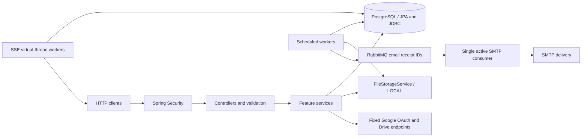

# Backend architecture and engineering review

This guide describes implemented boundaries and known limitations. Future changes
are tracked in [the engineering backlog](../PROMPTS.md). Runtime setup, migrations
and verification commands are maintained in [operations](operations.md).

## System boundary

Booker is a Java 25/Spring Boot MVC service backed by PostgreSQL. The repository
contains no client application. Controllers adapt HTTP requests to service methods;
services enforce authorization/business rules and transaction boundaries. JPA owns
book metadata queries; JDBC handles account, document, progress, event and queue
persistence. Flyway owns schema evolution; Hibernate only validates it.

No application cache exists. RabbitMQ is used for bounded request/decision email delivery;
other durable workflows remain in PostgreSQL. Durable events, import jobs,
mail receipts and deletion receipts live in PostgreSQL. JobRunr and telemetry starters
are dependencies; their presence does not establish application JobRunr jobs, public
job dashboards or production alerting. The LGTM Compose service is local tooling.

## Responsibilities

| Area | Main boundary |
| --- | --- |
| Signup/workspace | `WorkspaceController` is the HTTP adapter; `WorkspaceAccounts` provisions/loads principals |
| Sessions | `TokenService` issues/rotates tokens and checks database credential versions |
| Passwords | `PasswordService` manages tokens/revocation and configurable monthly successful-reset allowance; `PasswordResetDelivery` separates mail transport |
| Books | Private `BookService` and public `PublicBookService` share metadata mapping but retain distinct permissions/quotas |
| Documents | `BookDocumentService` authorizes, validates and activates immutable document metadata |
| Byte storage | `FileStorageService` streams bytes through opaque provider-generated keys |
| Reading | `ReadingProgressService` shares rules through a closed account/workspace scope enum |
| Drive | Connection/cipher/gateway/import services separate state, encryption, HTTP transport and queued work |
| Email queue | Bounded confirmed publisher, single active RabbitMQ consumer, database retry/failed receipts |
| Request quota | BookRequestRateLimiter uses workspace locking and indexed request history for 10 submissions per UTC month |
| Requests | `PublicLibraryRequestService` reviews requests and commits notification/mail receipts atomically |
| Notifications | Event store plus bounded virtual-thread SSE workers deliver workspace-scoped replay |
| Errors | `GlobalExceptionHandler` maps application/framework request errors to safe status-aware responses |

Records/DTOs expose only client data. Internal storage provider/keys and encrypted
Google credentials never appear in responses. `OpaqueTokens` centralizes random
bearer secrets and digests; passwords use salted PBKDF2 instead of SHA-256.

## Persistence model

| Table family | Identity and scope |
| --- | --- |
| `workspaces`, `workspace_users` | Workspace UUID; globally normalized email account key; OWNER has workspace, SUPER_ADMIN has none |
| `books` | BIGINT identity; PRIVATE has workspace, PUBLIC has none; exact author/title uniqueness per applicable scope |
| `book_documents` | Immutable UUID versions with provider/key, size/hash/pages/source; one active version per book |
| `reading_progress`, operations | Account/book primary key; account/operation retry identity; document/book foreign keys |
| `public_reading_progress`, operations | Workspace/book primary key and workspace/operation retry identity |
| `refresh_tokens`, `password_reset_tokens` | Hashed secrets with expiry; reset row unique per account; account credential version invalidates JWTs |
| `password_reset_history` | Successful recovery audit keyed by identity; indexed account/time query enforces the UTC monthly allowance across replicas |
| `google_drive_*` | Encrypted account connections, expiring hashed browser states and durable import jobs |
| `book_events`, cursor | Workspace events allocated by a commit-ordered transactional counter |
| `public_library_book_requests`, `public_request_emails` | Workspace request audit and committed typed administrator/requester email receipts with UUID publication/retry/failed state |
| `document_file_deletions` | Durable opaque-key cleanup receipts independent of deleted metadata |

The migration sequence and populated-upgrade requirements are in
[operations](operations.md#database-migrations-and-upgrades). No migration rollback
files exist; coordinated backup restoration or a forward fix is required.

## Transaction and concurrency invariants

- Login/refresh/password mutations lock the same account row. Password replacement
  increments credential version and removes reset/refresh sessions transactionally.
- Recovery reads post-lock database time and READ COMMITTED history, enforcing the
  positive PASSWORD_RESET_MONTHLY_LIMIT (default three per account per UTC month).
  Successful history and password/session updates commit together. Email issuance,
  failed/rolled-back attempts and authenticated changes do not consume allowance.
  Exhausted forgot-password stays generic 202 without mail; valid reset tokens
  receive 429/Retry-After, while invalid or expired tokens remain 400.
- Private creation locks its workspace for quota and uniqueness checks. The insert
  trigger writes an event before commit; rollback exposes neither book nor event.
- Document replacement/progress writes lock the authorized book. Metadata activation
  deactivates the old version and creates a new version within one transaction.
- Private uploads additionally lock workspace storage accounting; all retained versions
  count. Bytes are staged/validated before normal upload activation.
- Request submission locks its workspace, counts current UTC-month history under
  READ COMMITTED, and enforces a shared ten-request cap. Post-lock database time
  determines both the quota window and persisted creation timestamp. Failed/rolled-back
  submissions consume no allowance; reviews do not release it.
- Request submission snapshots every persisted Super Admin recipient into the outbox
  in the request transaction. Escaped HTML and plain-text notification bodies are
  stored together; bootstrap email configuration is not the runtime recipient source.
- Request acceptance currently holds its outer transaction and request lock during
  storage/parsing. It creates the book, activates PDF, records decision/event/email
  together. Rollback synchronization deletes retained upload bytes on database rollback;
  process crashes/failed cleanup still require orphan reconciliation.
- Progress uses optimistic server revisions and durable operation receipts. Stale
  updates may merge maximum page without moving resume/lastReadAt. Exact accepted
  retries return current state without another mutation. Client clocks are not trusted.
- Event allocation locks a global counter to maintain commit order. Polling filters
  by workspace; IDs may have gaps. Public catalogue writes do not emit private book events.
- The bounded email publisher locks due receipts with SKIP LOCKED and records confirmed
  RabbitMQ publication. The single active consumer locks one receipt, sends SMTP and
  commits deletion or delayed retry before acknowledgement; a crash before commit can
  duplicate delivery. Failed receipts are parked after the configured attempt limit. Drive workers claim a recoverable lease.
  File deletion is idempotent and its receipt persists until successful deletion.

## Security and HTTP boundaries

Spring Security supports stateless Bearer and legacy Basic. Authorization is checked
again in services so internal workflows use the same scopes. CORS is configurable,
without cross-origin credentials. OAuth requires same-browser binding, one-time state,
PKCE and an exact callback; stored credentials use account-bound AES-GCM. Upstream
hosts are fixed, redirect following is disabled and error inspection is bounded.

PDF validation checks extension, MIME/signature, parsed page count, encryption and
unsafe actions/scripts/attachments with bounded traversal and parser admission.
LOCAL storage streams with a fixed buffer and atomically publishes generated UUID
files; downloads reject symlinks. It is not a malware scanner or parser sandbox.

Application errors use `ApiError`, including 405/Allow and 406 for framework request
failures. Constraint diagnostics are not logged with exception causes because the
driver can include failing-row values. Security-filter responses, HEAD, byte-range
errors and revision-conflict 409 have their own documented body rules. Unexpected
server errors retain diagnostic context in access-controlled logs.

## Known limitations

Lists and request history are unpaginated. SSE polling scales per connection and
existing streams are not continuously reauthenticated. There is no event/receipt/
version retention policy, general traffic rate limiter or object-store provider.
Book-request submission has a PostgreSQL-backed shared monthly quota. LOCAL
replicas need shared storage. Reset SMTP holds the account transaction; request/decision
mail uses RabbitMQ with bounded retries, but SMTP still holds a receipt transaction.
The publisher has a separate scheduler; remaining scheduled workers share the default
scheduler, so long work can still delay other jobs. Sustained overload can grow the
PostgreSQL outbox despite bounded broker queues. Import leases lack heartbeat/fencing. Public raw uploads have no private
file/page/storage quota. Live Google/SMTP and client behaviors need separate checks.

These limits are documented rather than disguised as implemented infrastructure.
Prioritized requirements and acceptance tests are in [PROMPTS.md](../PROMPTS.md).

## Verification expectations

`OpenApiCoverageTest` checks all 43 business operations, generated success/error
schemas, auth visibility, PDF Range/binary/HEAD and both progress 409 shapes. It also
compares `API.md`'s inventory with registered application routes and public health.
The fixed `/tmp` OpenAPI export is removed from test execution; clients can download
`/v3/api-docs` from their target deployment.

Behavioral tests cover database invariants, tenant/role isolation, sessions/passwords,
PDF failures and large HEAD, revisions/retries/concurrency, request rollback, mail
receipts and simulated Google calls. Full verification requires disposable PostgreSQL, RabbitMQ
and the opt-in event JDBC variable. CI rejects skipped tests and builds Docker after
Maven verification. Local passing tests do not prove live provider delivery, frontend
implementation, production performance or restore readiness.
