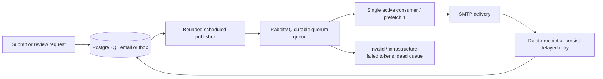

# RabbitMQ request email delivery

This guide owns broker topology, delivery limits and recovery. The
[request workflow](public-library-requests.md) owns HTTP and review behavior;
[operations](operations.md) owns general deployment and database setup.

## Scope and flow

RabbitMQ carries Super Admin submission alerts and requester decision emails.
Request submission/review still commits synchronously to PostgreSQL and returns
the existing response; SMTP and broker availability do not determine HTTP success.
PDF acceptance, Google imports, SSE events and password-reset email are not moved
to RabbitMQ. This bounds email processing, not incoming HTTP/database traffic;
gateway request limits remain necessary for sustained overload.



V14 preserves V13 email data and adds a stable UUID `id`, `published_at`,
`available_at`, `attempts` and `failed_at`. Existing queued emails become immediately
eligible. Each RabbitMQ message contains only the ASCII UUID, with persistent
delivery mode; recipients and HTML/plain-text bodies remain in PostgreSQL.

## Topology and load limits

- Main queue: `booker.request-emails`, durable quorum, single active consumer.
- Quarantine queue: `<main queue>.dead`, durable quorum.
- Both queues use a configurable maximum ready-message count and `reject-publish`.
  Quorum queue limits can slightly overshoot while rejection takes effect; they
  provide backpressure rather than an exact instantaneous count. The main queue
  uses at-least-once dead lettering to the quarantine queue.
- One listener thread per instance, concurrency fixed at 1 and prefetch fixed at 1.
  Single-active-consumer keeps sending sequential across replicas sharing the queue.
- The dedicated publisher scheduler has one thread. Each poll processes at most
  20 receipts by default; it stops on the first publication failure.
- A separate default worker scheduler and Spring application task executor remain
  available; email publication does not replace unrelated task execution.
- The default 1000-message broker limit is backpressure: rejected/returned/timed-out
  publications remain in PostgreSQL. This is not a total database backlog limit.

The topology follows RabbitMQ's [quorum queue](https://www.rabbitmq.com/docs/quorum-queues)
and [single active consumer](https://www.rabbitmq.com/docs/consumers#single-active-consumer)
behavior. Quorum queues need a healthy majority; production redundancy requires
an appropriately sized broker cluster. The one-node Compose service is development
infrastructure, not a highly available cluster.

## Confirmation, acknowledgement and retries

The publisher selects a due receipt with `FOR UPDATE SKIP LOCKED`, publishes using
mandatory routing and correlated confirms, waits up to five seconds for confirmation,
then records `published_at` in the transaction. It never deletes the email on publish.
The row lock is held during this bounded confirmation wait. Broker connection timeout
is five seconds. A failure stops the batch and the next poll retries publication.

The consumer locks the receipt by ID. Missing/completed, failed or not-yet-due
receipts are harmless no-ops. SMTP runs within that receipt transaction, with existing
five-second connection/read/write timeouts. Successful delivery deletes only that
receipt; RabbitMQ acknowledgement follows the committed database work.

SMTP failure updates the receipt and acknowledges the broker token. The publisher
later sends a new token when `available_at` is due. Default retry delays after failures
are 30, 60, 120 and 240 seconds, with delays capped at one hour. The fifth failure
sets `failed_at` and stops automatic retries. Other due emails can proceed while one
is waiting. Missing sender configuration defers existing tokens without consuming
attempts, and prevents new publication until configured.

Valid tokens rejected because of database/infrastructure exceptions, and malformed
tokens, go to `.dead` without an immediate requeue loop. A still-pending database
receipt is independently eligible for redispatch after five minutes. An old token
may remain in quarantine; completed-receipt duplicates are safe to discard.

Delivery is **at least once**, not exactly once. A crash after SMTP acceptance but
before database commit can resend an email. Publish-before-commit crashes or recovery
redispatch can duplicate tokens, but a completed receipt is never sent again. SMTP
failure classification is conservative: all send failures use the same bounded retry
policy. Provider throttling may require longer configured delays.

## Configuration

| Variable | Default / purpose |
| --- | --- |
| `BOOK_REQUEST_EMAIL_ENABLED` | true; false pauses publisher/listener and disables Rabbit health; receipts remain pending |
| `RABBITMQ_HOST`, `RABBITMQ_PORT` | localhost / 5672 in source mode; Compose fixes rabbitmq / 5672 |
| `RABBITMQ_USERNAME`, `RABBITMQ_PASSWORD` | booker / no usable default password; Compose requires a nonempty password |
| `RABBITMQ_VHOST` | `/`; isolate environments with distinct vhosts |
| `RABBITMQ_SSL_ENABLED` | false locally; use true and the broker TLS port for production, with trusted certificates |
| `RABBITMQ_MEMORY_LIMIT`, `RABBITMQ_CPU_LIMIT` | Compose-only container limits: 512m / 1.0; size production capacity separately |
| `BOOK_REQUEST_EMAIL_QUEUE` | booker.request-emails; all replicas in one deployment must share it |
| `BOOK_REQUEST_EMAIL_POLL_MILLIS` | 1000; fixed delay after each bounded publisher pass |
| `BOOK_REQUEST_EMAIL_BATCH_SIZE` | 20; range 1–100 |
| `BOOK_REQUEST_EMAIL_QUEUE_LIMIT` | 1000; range 1–100000; declaration-time argument for both queues |
| `BOOK_REQUEST_EMAIL_MAX_ATTEMPTS` | 5; range 1–20 |
| `BOOK_REQUEST_EMAIL_RETRY_SECONDS` | 30; range 1–3600, exponential delay capped at one hour |
| `BOOK_REQUEST_EMAIL_REDISPATCH_SECONDS` | 300; range 30–86400; recovery window after confirmed publication |

Actual delivery requires `SMTP_HOST` and the provider's `SMTP_*` credentials/options.
The request sender uses the first nonblank value of `BOOK_REQUEST_EMAIL_FROM`,
`PASSWORD_RESET_FROM`, and `SMTP_USERNAME`. Set `BOOK_REQUEST_EMAIL_FROM` to a
provider-approved email address when the SMTP username is an API key or login name.
A missing sender or mail bean pauses publication and logs a warning once per pause;
receipts remain pending. Maven does not load `.env`: export the settings into the
Java process environment; Compose passes the settings explicitly.
With the feature disabled there is no fallback polling SMTP worker; pending emails
wait until RabbitMQ delivery is enabled again. `books.requests.email.listener-auto-startup`
is a Spring property defaulting to true; broker tests disable it to manage isolated
consumers explicitly. It does not replace the full feature pause setting.

Compose exposes AMQP at `127.0.0.1:5672` and the management UI at
`http://localhost:15672`, using the configured broker credentials. It persists broker
data in `rabbitmq-data`. Default credentials/vhost provision an empty volume only;
changing `.env` does not update accounts in an existing broker volume. Compose uses
plain AMQP inside its local network; use external Spring configuration and a secured
deployment for TLS. Never expose management ports publicly or use the guest account.

Changing queue type, single-active-consumer or queue-limit arguments on an existing
queue may fail declaration with `PRECONDITION_FAILED`. Coordinate a drained replacement
queue or use reviewed broker policies where supported; do not delete a live queue
to silence startup errors. Stop old application versions before enabling the new
publisher: the former direct SMTP worker must not run beside RabbitMQ consumers.

## Operations and recovery

Monitor broker ready/unacknowledged counts, consumer availability, queue rejection,
dead letters, disk/memory alarms and PostgreSQL outbox age. Queue counts are bounded;
PostgreSQL can still grow under a sustained peak. Configure gateway limits, disk
headroom, alerts and an operator backlog policy. Broker limits do not promise a
particular throughput or eliminate all failure windows during consumer failover.

A row in `public_request_emails` means delivery is pending or parked, not that an
email has been sent. If `attempts=0` and `published_at` is null, check the feature
flag, sender configuration warning, exported environment and broker connection.
Previously a blank `PASSWORD_RESET_FROM` silently paused publication even when SMTP
credentials were set. Request mail now falls back to `SMTP_USERNAME`; restart the
updated backend with the intended environment to process existing pending receipts.
Password-reset mail still requires its own `PASSWORD_RESET_FROM` setting.

Inspect pending and parked work without exposing mail bodies:

```sql
SELECT email_type, count(*) AS pending, min(created_at) AS oldest
FROM public_request_emails WHERE failed_at IS NULL GROUP BY email_type;

SELECT id, email_type, attempts, created_at, published_at, available_at, failed_at
FROM public_request_emails WHERE failed_at IS NOT NULL ORDER BY failed_at;
```

After fixing the sender/provider problem, retry one reviewed receipt explicitly:

```sql
UPDATE public_request_emails
SET failed_at=NULL, attempts=0, published_at=NULL, available_at=now()
WHERE id='replace-with-reviewed-receipt-uuid';
```

If the broker queue is lost, retained receipts automatically become publishable
after the redispatch window. Review `.dead` for malformed publishers or infrastructure
failures; do not automatically replay malformed payloads. Back up PostgreSQL and
broker configuration/data, protect credentials and restrict vhost permissions to
this application's queues. One deployment's replicas must share the same database,
vhost and queue names. Separate deployments must not consume each other's IDs.

## Verification

`RequestEmailRabbitIntegrationTest` requires a real RabbitMQ broker plus disposable
PostgreSQL. It creates an isolated schema and queues and cleans them up. SMTP is
mocked. Tests cover a 25-email peak with two attached consumers and maximum observed
SMTP concurrency of one, full-queue rejection, delayed retries without blocking
healthy mail, exhausted retries, duplicate tokens, malformed-token quarantine and
stale-receipt recovery. Unit tests cover bounded publishing, broker failure and
confirmation behavior; migration tests preserve pending V13 receipts.

CI provides PostgreSQL 18 and RabbitMQ 4.2. General backend contexts set
`BOOK_REQUEST_EMAIL_ENABLED=false`; the broker integration test explicitly enables
the feature. No RabbitMQ tests are skipped to obtain a green build. Test databases
and brokers must be disposable; live SMTP, production cluster failover and actual
peak throughput still require deployment-specific verification.
